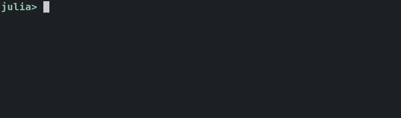

# InteractiveCodeSearch.jl –- Interactively search Julia code

[![Build Status][travis-img]][travis-url]
[![Coverage Status][coveralls-img]][coveralls-url]
[![codecov.io][codecov-img]][codecov-url]




Julia has `@edit`, `@less`, etc. which are very handy for reading the implementation of functions.  However, you need to specify a "good enough" set of (type) parameters for them to find the location of the code.

Instead, `InteractiveCodeSearch` provides a few macros to interactively choose the code you want to read.

## Features

  * Interactively choose a method signature before opening the code location in your editor.
  * Various ways to search methods, such as: by function name `@search show`, function call expression `@search show(stdout, "hello")`, function call signature `@search show(::IO, ::String)`, module name `@search Base`, argument value `@searchmethods 1`, argument type `@searchmethods ::Int`, and return type `@searchreturn Int`.
  * Interactively search history.  It works in IJulia as well.

## Examples

```julia
using InteractiveCodeSearch
@search show             # search method definitions
@searchmethods 1         # search methods defined for integer
@searchhistory           # search history (Julia ≥ 0.7)
@searchreturn String Pkg # search methods returning a given type (Julia ≥ 0.7)
```

## Requirements

  * Interactive matching command.  For example:

      * [peco](https://github.com/peco/peco) (default in terminal)
      * [percol](https://github.com/mooz/percol)
      * [rofi](https://github.com/DaveDavenport/rofi) (GUI; default in IJulia)

## Reference

### `@search`

```
@search x [:shallow | :s | :recursive | :r]
```

List file locations at which `x` are defined in an interactive matcher and then open the chosen location in the editor.

When `x` is a module, only the top-level definitions are searched.  To search all definitions in the submodule, pass `:recursive` or `:r` flag.

```
@search
```

If no expression is provided, search for the method returned by the previous execution; i.e., `x` defaults to `ans`.

**Examples**

```julia
@search show                      # all method definitions
@search @time                     # all macro definitions
@search Base.Enums                # methods and macros in a module
@search REPL :r                   # search the module recursively
@search *(::Integer, ::Integer)   # methods with specified types
@search dot(π, ℯ)                 # methods with inferred types
```

Note that `@search` evaluates complex expression with `.` and `[]` such as follows and search the returned value or the type of it:

```julia
@search Base.Multimedia.displays[2].repl
```


### `@searchmethods`

```
@searchmethods x
@searchmethods ::X
```

Interactively search through `methodswith(typeof(x))` or `methodswith(X)`.

**Examples**

```julia
@searchmethods 1         # search methods defined for integer
@searchmethods ::Int     # search methods defined for a specified type
```


### `@searchhistory`

```
@searchhistory
```

Search history interactively.  Interactively narrows down the code you looking for from the REPL history.

*Limitation/feature in IJulia*: In IJulia, `@searchhistory` searches history of terminal REPL, not the history of the current IJulia session.


### `@searchreturn`

```
@searchreturn Type [Module...]
```

Search functions returning type `Type` in `Module`s.  As this search typically takes some time to finish, interactive matcher will not be launched by this command.  Instead, a "handle" to the search in background is returned which can be queried via `@search` later. Calling `kill` (`Base.kill`) on the handle cancels the search.

**Limitations**

  * Running `@searchreturn` for many modules may be slow for the *first* run.  Thus, searching from all modules (i.e., not specifying `Module` arguments) may take tens of seconds to minutes, depending of what are loaded.  Searching within `Base` takes about 30 seconds. After `DifferentialEquations` is loaded, searching for all modules takes 1.5 minutes.  Note that searching from the same module for the second time is fast (a few seconds), even if different `Type` is specified.
  * The functions must be executed (JIT'ed) once for `@searchreturn` to find their returned by type.
  * Any IO operations (like printing in REPL) would be slow while the search is active in background.
  * Keyboard interruption does not work well while background search is active.  You need to hit CTRL-C multiple times to terminate a "foreground" code.  Furthermore, it will bring down the background search task as well.

**Examples**

```julia-repl
julia> using LinearAlgebra, SparseArrays

julia> spzeros(3, 3)

julia> @searchreturn AbstractMatrix LinearAlgebra SparseArrays
┌ Info: Search result is stored in variable `_s1`.
│ You can interactively narrow down the search result later by
└ `@search _s1` or `@search 1`.

BackgroundSearch id=1 [active] 0 found
Searching ::AbstractArray{T,2} where T from Module[LinearAlgebra SparseArrays] recursively

julia> @search _s1

julia> kill(_s1)  # stop the search
```

If you prefer giving a custom name to the search result, just assign it to some variable.

```julia-repl
julia> my_search = @searchreturn AbstractMatrix LinearAlgebra SparseArrays
julia> @search my_search
```


### `InteractiveCodeSearch.CONFIG`
Configuration interface for `InteractiveCodeSearch`.

**Examples**

```julia
using InteractiveCodeSearch
InteractiveCodeSearch.CONFIG.interactive_matcher = `peco`  # default in terminal
InteractiveCodeSearch.CONFIG.interactive_matcher = `percol`
InteractiveCodeSearch.CONFIG.interactive_matcher =
    `rofi -dmenu -i -p "🔎"`  # use GUI matcher (default in non-terminal
                              # environment like IJulia)
InteractiveCodeSearch.CONFIG.interactive_matcher =
    `rofi -dmenu -i -p "🔎" -fullscreen`  # bigger screen
InteractiveCodeSearch.CONFIG.open = edit  # default
InteractiveCodeSearch.CONFIG.open = less  # use Base.less to read code
InteractiveCodeSearch.CONFIG.auto_open = true   # default
InteractiveCodeSearch.CONFIG.auto_open = false  # open matcher even when there
                                                # is only one candidate
```

**Using InteractiveCodeSearch.jl by default**

Put the following code in your `~/.julia/config/startup.jl` (≥ Julia 0.7) or `~/.juliarc.jl` (Julia 0.6):

```julia
using InteractiveCodeSearch
# InteractiveCodeSearch.CONFIG.interactive_matcher = ...
```


[travis-img]: https://travis-ci.org/tkf/InteractiveCodeSearch.jl.svg?branch=master
[travis-url]: https://travis-ci.org/tkf/InteractiveCodeSearch.jl
[coveralls-img]: https://coveralls.io/repos/tkf/InteractiveCodeSearch.jl/badge.svg?branch=master&service=github
[coveralls-url]: https://coveralls.io/github/tkf/InteractiveCodeSearch.jl?branch=master
[codecov-img]: http://codecov.io/github/tkf/InteractiveCodeSearch.jl/coverage.svg?branch=master
[codecov-url]: http://codecov.io/github/tkf/InteractiveCodeSearch.jl?branch=master

<!--
Generated by `./scripts/generate_readme.jl README.md`.
-->
